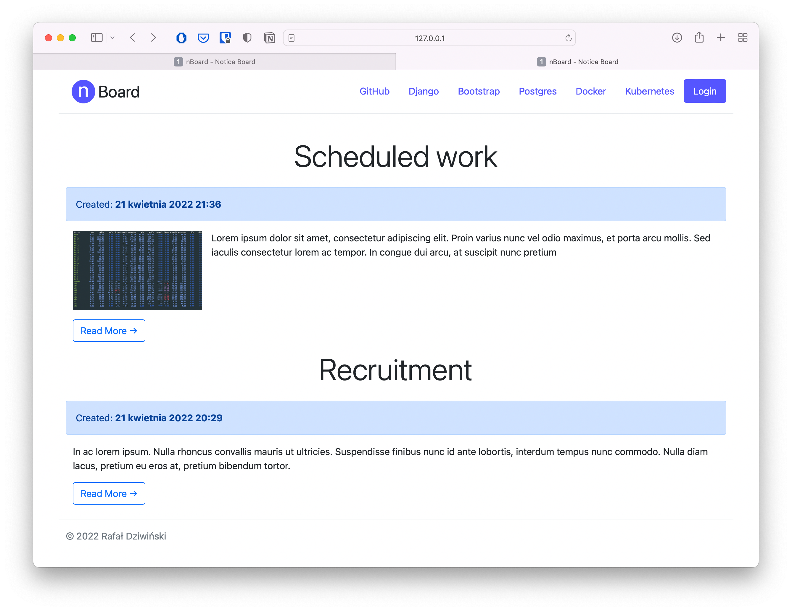

# nBoard
Simple Notice Board app writing in Django. 

Used technologies:
* Django 4
* Postgres 13
* Bootstrap 4

### v1.0
* Add any notice via Django Admin Panel
* Possible to add Image
* Preparing model for feature from v1.5

### Planned v1.2
* Add support for type of notice: Announcement, Maintenance, Problem
* Add support for status of notice: Future, In progress, Archive.

HomePage:

Admin Panel:

 vcv  

